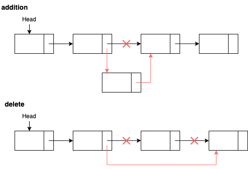

# Basic Array

## Array vs Linked List

<table>
    <tr>
        <td><b>Array</b></td>
        <td rowSpan="2"></td>
    </tr>
    <tr>
        <td>
            <ol>
                <li>儲存於連續記憶體 (sequential memory)</li>
                <li>需事先宣告<a style="color:red">（易造成記憶體浪費）</a></li>
                <li>易於讀取＆修改<a style="color:red">（連續記憶體，用 index 取資料）</a></li>
                <li>難於刪除＆新增<a style="color:red">（需移動大量資料）</a></li>
            </ol>
        </td>
    </tr>
    <tr>
        <td><b>Linked List</b></td>
        <td rowSpan="2"></td>
    </tr>
    <tr>
        <td>
            <ol>
                <li>記憶體不連續 (不用預留空間)</li>
                <li>需事先宣告<a style="color:red">（易造成記憶體浪費）</a></li>
                <li>易於刪除＆新增</li>
                <li>不易查詢<a style="color:red">（需從頭查找）</a></li>
            </ol>
        </td>
    </tr>
</table>

||Array|Linked List|
|--|:--:|:--:|
|記憶體配置|連續|不連續|
|記憶體使用||彈性大|
|取資料速度|O(1)|O(n)|
|刪資料速度|O(n)|O(1)|
|插入資料|O(n)|O(1)|

## 2D array implement

## Application

- Polynomial
- Matrix
- Sparse Matrix